<div align="center">

# Risco de Crédito: Inadimplência em Cartão

### MVP: Machine Learning & Analytics, classificação binária supervisionada com scikit-learn

[](https://colab.research.google.com/github/XAKCN/Machine-Learning_Puc-Rio/blob/main/Machine_Learning.PUC-Rio.ipynb)
[](https://www.python.org/)
[](https://scikit-learn.org/)
[](https://pandas.pydata.org/)
[](https://archive.ics.uci.edu/dataset/350/default+of+credit+card+clients)
[](https://creativecommons.org/licenses/by/4.0/)

[Visão geral](#visão-geral) · [Problema](#1-definição-do-problema) · [Dados](#2-dados) · [Preparação](#3-preparação-dos-dados) · [Modelagem](#4-modelagem-e-seleção) · [Limiar](#5-escolha-do-limiar) · [Avaliação](#6-avaliação-final-no-teste) · [Calibração e fairness](#7-calibração-e-fairness-exploratória) · [Conclusão](#8-conclusão) · [Como executar](#como-executar)

</div>

---

## Visão geral

<table>
<tr>
<td align="center"><b>30.000</b><br/>clientes</td>
<td align="center"><b>22,1%</b><br/>de inadimplentes</td>
<td align="center"><b>4</b><br/>modelos comparados</td>
<td align="center"><b>0,782</b><br/>ROC-AUC no teste</td>
<td align="center"><b>75%</b><br/>dos defaults detectados no limiar 0,16</td>
</tr>
</table>

| Etapa | Resultado em uma linha |
|---|---|
| **Seleção** | **Gradient Boosting Tuned** vence por regra definida *antes* dos resultados (maior ROC-AUC com gap ≤ 0,05) |
| **Random Forest** | Teve o maior ROC-AUC de CV (0,7842), mas foi **inelegível**: gap treino-CV de **0,0947** |
| **Teste final** | ROC-AUC **0,7824** · PR-AUC **0,5552** (baseline 0,2212) · gap treino-teste **0,0305** |
| **Limiar** | **0,16** escolhido em previsões *out-of-fold* do treino com custo FN=5 / FP=1: recall sobe de **35,9%** para **75,1%** |
| **Calibração** | Brier **0,1342** (treino OOF) vs. **0,1350** (teste): probabilidades bem calibradas e estáveis fora da amostra |
| **Sinal dominante** | Atraso de 2 meses no mês mais recente (`status_pagamento_1_2`) responde por **42,6%** da importância |

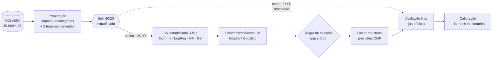

> [!IMPORTANT]
> **O conjunto de teste foi tocado uma única vez.** Comparação de candidatos, tuning, seleção do modelo e escolha do limiar usam apenas `X_train`. No teste entram somente o `DummyClassifier` e o modelo já fixado, o que evita viés de seleção.

<details>
<summary><b>Estrutura do repositório</b></summary>

```text
.
├── Machine_Learning.PUC-Rio.ipynb   # notebook executável (relatório técnico)
├── default of credit card clients.xls                      # dataset original (UCI #350)
├── docs/
│   └── img/                                                # gráficos exportados do notebook
└── README.md
```

</details>

---

## 1. Definição do Problema

> **Problema:** estimar a probabilidade de um cliente de cartão de crédito entrar em **default no mês seguinte**, a partir do seu histórico de pagamento, faturas, limite e perfil demográfico.

| Item | Definição |
|---|---|
| **Tarefa** | Classificação supervisionada binária |
| **Variável-alvo** | `inadimplente_proximo_mes` (0 = adimplente, 1 = inadimplente) |
| **Por que ML** | Grande volume rotulado; relações não-lineares e multivariadas entre comportamento de pagamento e risco |
| **Escopo** | MVP acadêmico: demonstra um fluxo de ML rigoroso, **não** um score de crédito de produção |

**Hipóteses:**

1. O **histórico de pagamento recente** carrega sinal preditivo sobre o comportamento futuro;
2. **Razões entre fatura, pagamento e limite** se correlacionam com a propensão ao default;
3. **Variáveis demográficas** agregam poder discriminante quando combinadas às comportamentais;
4. Os dados históricos são **representativos** da população-alvo para fins acadêmicos.

---

## 2. Dados

| Atributo | Valor |
|---|---|
| **Dataset** | Default of Credit Card Clients |
| **Fonte** | [UCI Machine Learning Repository, ID 350](https://archive.ics.uci.edu/dataset/350/default+of+credit+card+clients) |
| **DOI** | [10.24432/C55S3H](https://doi.org/10.24432/C55S3H) |
| **Registros** | 30.000 clientes (Taiwan, 2005) |
| **Atributos explicativos** | 23 originais + 2 derivados |
| **Valores ausentes** | 0 |
| **Carga** | `pd.read_excel` direto da URL *raw* deste repositório |

**Grupos de variáveis** (renomeadas para português no carregamento):

| Grupo | Variáveis | Descrição |
|---|---|---|
| Limite | `limite_credito` | Limite concedido (NT$) |
| Demográficas | `sexo`, `escolaridade`, `estado_civil`, `idade` | Perfil do cliente |
| Histórico de pagamento | `status_pagamento_1` … `_6` | Status nos últimos 6 meses (`-2`, `-1`, `0`, meses de atraso) |
| Faturas | `valor_fatura_1` … `_6` | Valor da fatura nos últimos 6 meses |
| Pagamentos | `valor_pagamento_1` … `_6` | Valor pago nos últimos 6 meses |
| **Alvo** | `inadimplente_proximo_mes` | Default no mês seguinte |

### Análise exploratória

<table>
<tr>
<td width="50%">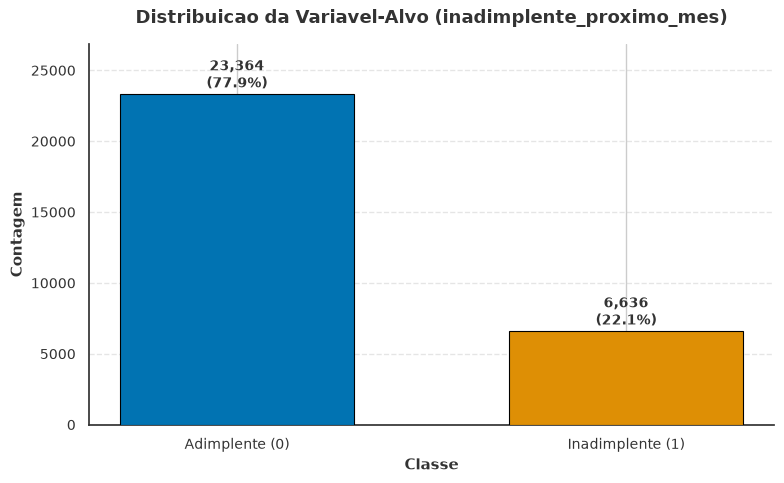</td>
<td width="50%">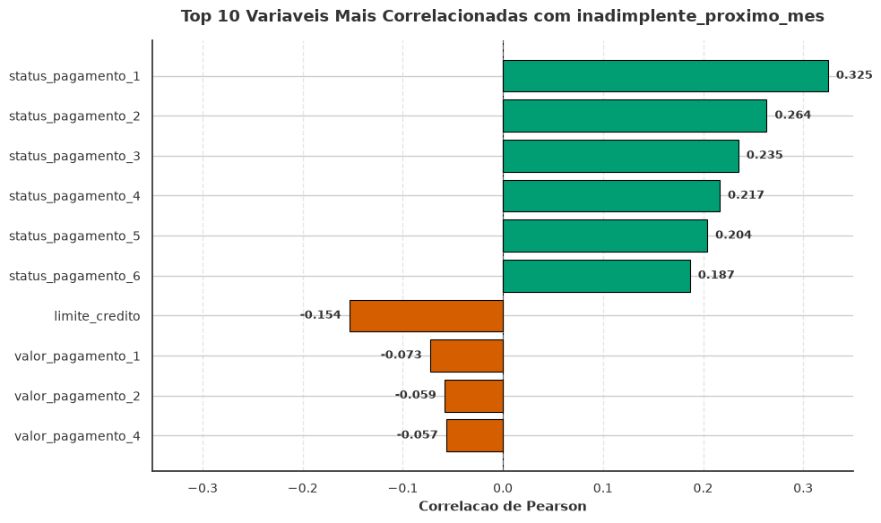</td>
</tr>
<tr>
<td><sub><b>Desbalanceamento:</b> 23.364 adimplentes (77,9%) vs. 6.636 inadimplentes (22,1%). Por isso, accuracy isolada é enganosa.</sub></td>
<td><sub><b>Correlação:</b> os 6 status de pagamento lideram (0,32 → 0,19), decaindo do mês mais recente para o mais antigo. Faturas quase não se correlacionam linearmente.</sub></td>
</tr>
</table>

<details>
<summary><b>Distribuição dos status de pagamento</b></summary>
<p align="center">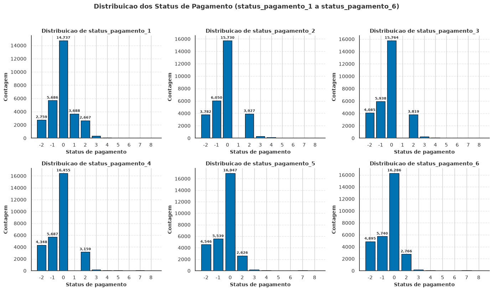</p>
</details>

**Inconsistências encontradas na EDA:** `escolaridade` tem códigos `0`, `5`, `6` não documentados (345 registros), e `estado_civil` tem o código `0` (54 registros). Faturas negativas existem (saldo credor) e foram mantidas.

---

## 3. Preparação dos Dados

| Transformação | Detalhe | Por quê |
|---|---|---|
| **Consolidação de categorias** | `escolaridade` {0, 5, 6} → 4 (*others*); `estado_civil` 0 → 3 (*others*) | Códigos sem documentação e com baixa frequência |
| **Rótulos descritivos** | `sexo`, `escolaridade`, `estado_civil` mapeados para texto | Legibilidade e encoding nominal explícito |
| **`razao_fatura_limite`** | `valor_fatura_1 / limite_credito` | Utilização do limite |
| **`razao_pagamento_fatura`** | `valor_pagamento_1 / valor_fatura_2` | Quanto da fatura anterior foi pago |
| **Status como categóricos** | `status_pagamento_1…6` → `OneHotEncoder` | São **estados discretos**, não grandezas: escalar imporia distâncias artificiais entre códigos |

As features derivadas são calculadas **linha a linha**, sem usar o alvo nem estatísticas globais, e portanto **sem data leakage**. Divisões por zero e infinitos viram `0`.

```text
Pipeline
├── ColumnTransformer
│   ├── num (16) ── SimpleImputer(median) ── StandardScaler
│   └── cat  (9) ── SimpleImputer(most_frequent) ── OneHotEncoder(handle_unknown="ignore")
└── modelo
```

Todo o pré-processamento vive **dentro** do `Pipeline`, então imputadores, scaler e encoder são ajustados apenas no treino de cada fold.

---

## 4. Modelagem e Seleção

**Divisão:** 80/20 estratificada (`random_state=42`), com 24.000 amostras de treino e 6.000 de teste e taxa de default idêntica (22,12%) nos dois conjuntos. Toda a validação é `StratifiedKFold(3)` **só no treino**.

### Regra de seleção (definida antes dos resultados)

1. Elegíveis: modelos com **gap ROC-AUC treino − CV ≤ 0,05**;
2. Entre eles, vence o **maior ROC-AUC médio de validação**;
3. Empate prático → menor gap;
4. Nenhum elegível → menor gap, com a exceção registrada.

### Resultados da validação cruzada (treino)

| Modelo | ROC-AUC | PR-AUC | Recall | Precision | F1 | Gap ROC-AUC | Elegível |
|---|:---:|:---:|:---:|:---:|:---:|:---:|:---:|
| Random Forest | **0,7842** | 0,5514 | 0,6141 | 0,4884 | 0,5441 | 0,0947 | ❌ |
| **Gradient Boosting Tuned** ⭐ | 0,7838 | 0,5538 | 0,3709 | 0,6765 | 0,4791 | 0,0378 | ✅ |
| Gradient Boosting | 0,7830 | **0,5550** | 0,3613 | 0,6836 | 0,4727 | 0,0279 | ✅ |
| Logistic Regression | 0,7692 | 0,5392 | 0,5801 | 0,4917 | 0,5322 | 0,0072 | ✅ |
| Dummy Baseline | 0,5000 | 0,2212 | 0,0000 | 0,0000 | 0,0000 | 0,0000 | ✅ |

> [!NOTE]
> A Random Forest ganhou por apenas **0,0005** de ROC-AUC, pagando com um gap **2,5×** maior que o do GB Tuned. Pela regra predefinida, esse ganho marginal não compensa o sobreajuste.

<p align="center">
  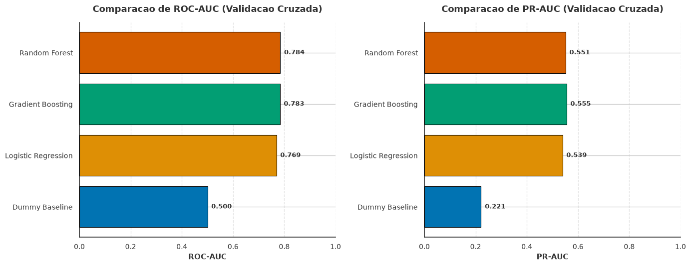
</p>

### Otimização de hiperparâmetros

`RandomizedSearchCV` sobre o Gradient Boosting (6 combinações × 3 folds = 18 ajustes, ~25 s), com `refit="roc_auc"`:

| Hiperparâmetro | Espaço | Melhor |
|---|---|:---:|
| `n_estimators` | {80, 120} | **120** |
| `learning_rate` | {0,05, 0,10} | **0,10** |
| `max_depth` | {2, 3} | **3** |
| `subsample` | {0,8, 1,0} | **0,8** |

---

## 5. Escolha do Limiar

O limiar padrão de 0,5 ignora o custo assimétrico do crédito: **deixar passar um inadimplente custa mais que recusar um bom pagador**. O limiar foi escolhido com previsões **out-of-fold** de `X_train` (cada cliente pontuado por um modelo que não o viu), minimizando um custo ilustrativo **FN = 5, FP = 1**.

<table>
<tr>
<td width="55%">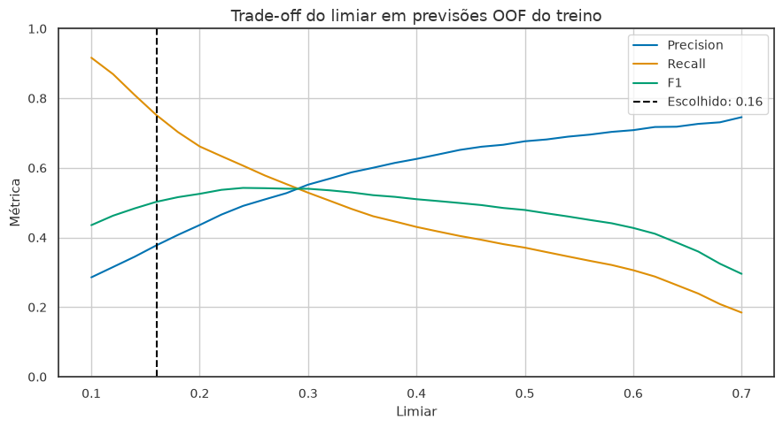</td>
<td>

| Limiar | Precision | Recall | F1 | Custo |
|:---:|:---:|:---:|:---:|:---:|
| **0,16** ⭐ | 0,377 | **0,752** | 0,503 | **13.173** |
| 0,30 | 0,552 | 0,529 | 0,540 | 14.790 |
| 0,40 | 0,626 | 0,430 | 0,510 | 16.487 |
| 0,50 | 0,676 | 0,371 | 0,479 | 17.642 |

<sub>Valores OOF no treino (24.000 clientes).</sub>

</td>
</tr>
</table>

---

## 6. Avaliação Final no Teste

Primeiro e único acesso ao conjunto de teste (6.000 clientes).

| Modelo | ROC-AUC | PR-AUC | Accuracy | Precision | Recall | F1 |
|---|:---:|:---:|:---:|:---:|:---:|:---:|
| Dummy Baseline | 0,5000 | 0,2212 | 0,7788 | 0,0000 | 0,0000 | 0,0000 |
| **Gradient Boosting Tuned** | **0,7824** | **0,5552** | **0,8180** | **0,6639** | **0,3587** | **0,4658** |

**Efeito do limiar (fixado no treino, apenas reportado no teste):**

| Limiar | Precision | Recall | F1 | Falsos negativos | Falsos positivos | Custo (5·FN + FP) |
|---|:---:|:---:|:---:|:---:|:---:|:---:|
| Padrão 0,50 | 0,6639 | 0,3587 | 0,4658 | 851 | 241 | 4.496 |
| **Custo 0,16** | 0,3721 | **0,7506** | **0,4975** | **331** | 1.681 | **3.336** |

No limiar 0,16, o modelo deixa de perder **520 inadimplentes** em troca de 1.440 alarmes falsos a mais, o que representa **−26% no custo ilustrativo**.

<table>
<tr>
<td colspan="2">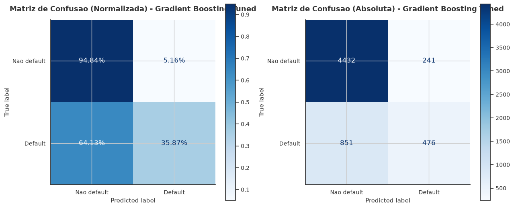</td>
</tr>
<tr>
<td width="50%">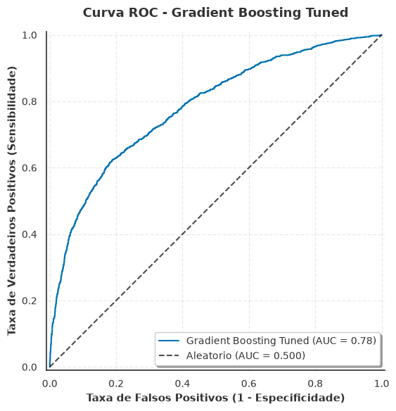</td>
<td width="50%">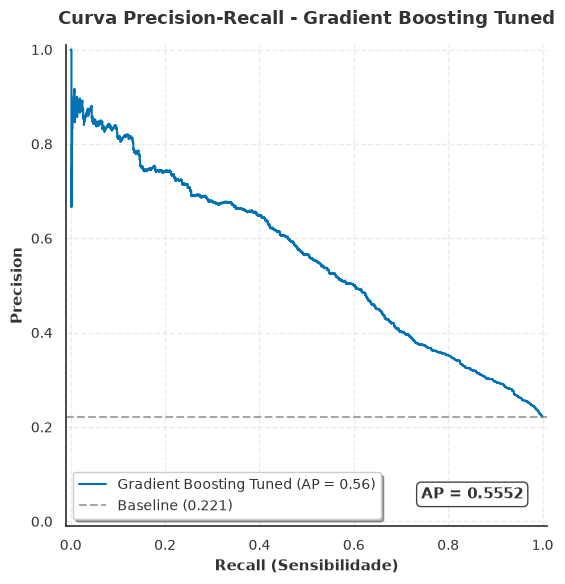</td>
</tr>
</table>

### Overfitting e underfitting

| Modelo | Diagnóstico | Evidência |
|---|---|---|
| **GB Tuned** | Sobreajuste **moderado** | ROC-AUC 0,8128 treino vs. 0,7824 teste (gap 0,0305), consistente com a CV |
| Random Forest | Sobreajuste **substancial** | Gap treino-CV 0,0947 |
| Logistic Regression | Leve **subajuste** | Gap mínimo (0,0072), mas teto de ROC-AUC mais baixo (0,7692) |
| Dummy | Subajuste **deliberado** | Piso de comparação: ROC-AUC 0,5, recall 0 |

### O que o modelo aprendeu

<p align="center">
  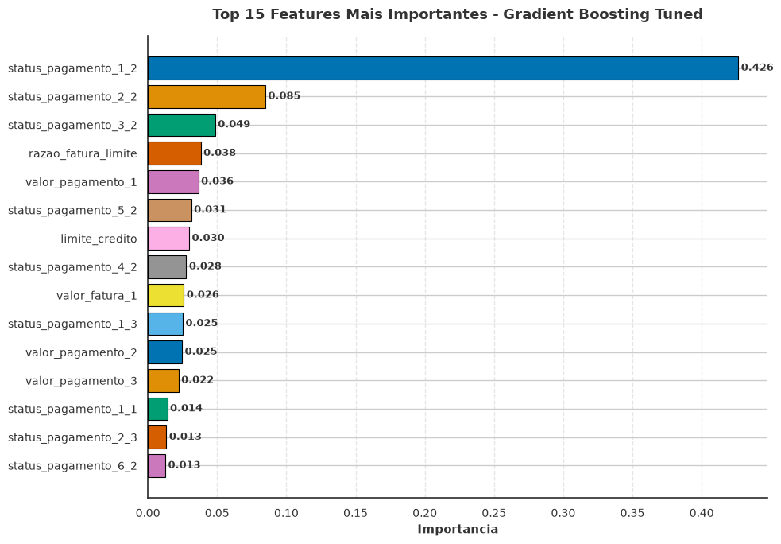
</p>

O modelo é essencialmente um leitor de **histórico de pagamento recente**: `status_pagamento_1_2` (2 meses de atraso no mês mais recente) concentra **0,426** da importância, seguido pelo mesmo sinal nos meses 2 e 3. A feature derivada `razao_fatura_limite` aparece em **4º lugar** (0,038), o que valida a engenharia de features.

---

## 7. Calibração e Fairness Exploratória

<table>
<tr>
<td width="50%">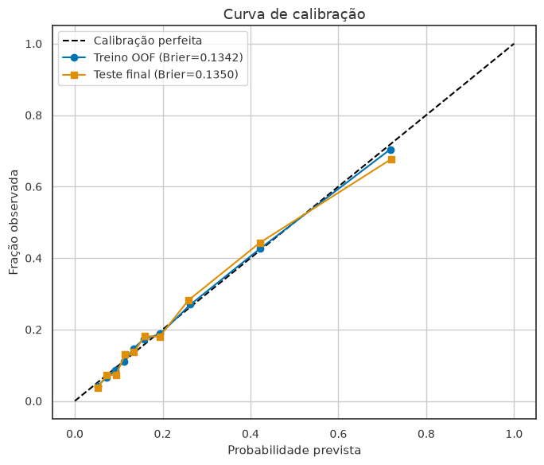</td>
<td>

**Calibração:** Brier Score **0,1342** (treino OOF) vs. **0,1350** (teste). A curva fica colada à diagonal, com leve superestimação só no decil de maior risco (~0,72 previsto vs. ~0,68 observado). Ou seja, um score de 30% significa de fato cerca de 30% de defaults, algo que o ROC-AUC (que só mede ordenação) não garante.

**Fairness exploratória por sexo** (limiar 0,16, teste):

| Grupo | n | Prevalência | Recall | FPR |
|---|:---:|:---:|:---:|:---:|
| Feminino | 3.598 | 21,3% | 0,743 | 0,335 |
| Masculino | 2.402 | 23,4% | 0,761 | 0,398 |

Δ recall = **0,018** · Δ FPR = **0,063**

</td>
</tr>
</table>

> [!CAUTION]
> A análise de fairness é **exploratória**: não prova discriminação nem equidade, não tem inferência causal e **não foi usada** para retreinar, selecionar modelo ou mudar o limiar.

---

## 8. Conclusão

O **Gradient Boosting Tuned** foi fixado antes de qualquer acesso ao teste, por uma regra formal e reproduzível. No teste, generalizou de forma coerente com a validação cruzada (ROC-AUC **0,7838** na CV → **0,7824** no teste) e mais que dobrou o PR-AUC do baseline (**0,5552** vs. **0,2212**).

No limiar padrão, o modelo é **conservador**: acerta 66% dos alertas, mas deixa passar **64%** dos inadimplentes. O limiar sensível a custo (**0,16**), escolhido sem olhar o teste, inverte essa relação e captura **75%** dos defaults. Qual ponto operar é uma decisão de negócio, e o notebook deixa esse trade-off explícito e parametrizável.

### Limitações

| Limitação | Impacto |
|---|---|
| Dados de **Taiwan, 2005** | Não generalizam para o mercado brasileiro atual sem validação externa |
| Sem renda, ocupação, patrimônio ou macroeconomia | Teto de desempenho limitado pelas variáveis disponíveis |
| Divisão aleatória, não temporal | Produção exigiria validação *out-of-time* |
| Custos FN/FP **ilustrativos** | O limiar real depende da economia da carteira |
| Fairness sem inferência causal | Não substitui uma auditoria de viés |

> [!WARNING]
> Projeto **exclusivamente acadêmico**. Não atende a requisitos regulatórios, de governança, explicabilidade ou monitoramento de um modelo de crédito real e **não deve ser usado para decisões de crédito**.

---

## Boas práticas aplicadas

| Prática | Evidência |
|---|---|
| **Reprodutibilidade** | `RANDOM_STATE=42` em numpy, random e modelos; versões impressas; parâmetros via `.env` opcional |
| **Sem data leakage** | Pré-processamento dentro do `Pipeline`; features derivadas linha a linha; limiar em OOF |
| **Teste intocado** | Seleção, tuning e limiar só no treino; teste avaliado uma vez, com 2 modelos |
| **Seleção honesta** | Regra de gap declarada antes dos resultados |
| **Métricas para desbalanceamento** | ROC-AUC, PR-AUC, recall, precision, F1, Brier e accuracy |
| **Conclusão sem números fixos** | Texto final gerado dinamicamente a partir das métricas calculadas |
| **Checagens automáticas** | 16 `assert`s no fim do notebook validam shapes, disjunção treino/teste, ranges e regra de seleção |
| **Execução rápida** | Notebook completo roda em **~60 s** |

---

## Como executar

**Opção 1: Google Colab (recomendado)**

Clique em [](https://colab.research.google.com/github/XAKCN/Machine-Learning_Puc-Rio/blob/main/Machine_Learning.PUC-Rio.ipynb) e execute *Runtime → Run all*. O dataset é baixado automaticamente da URL *raw* deste repositório.

**Opção 2: local**

```bash
git clone https://github.com/XAKCN/Machine-Learning_Puc-Rio.git
cd Machine-Learning_Puc-Rio
pip install numpy pandas scikit-learn matplotlib seaborn xlrd python-dotenv jupyter
jupyter notebook Machine_Learning.PUC-Rio.ipynb
```

<details>
<summary><b>Parâmetros configuráveis via <code>.env</code> (opcional)</b></summary>

| Variável | Padrão | Uso |
|---|:---:|---|
| `RANDOM_STATE` | `42` | Semente global |
| `CV_SPLITS` | `3` | Folds da validação cruzada |
| `TEST_SIZE` | `0.20` | Proporção do teste |
| `GB_RANDOM_SEARCH_ITER` | `6` | Iterações do `RandomizedSearchCV` |
| `MAX_ROC_AUC_GAP` | `0.05` | Gap máximo da regra de seleção |
| `FN_COST` / `FP_COST` | `5` / `1` | Custos ilustrativos do limiar |
| `THRESHOLD_MIN` / `MAX` / `STEP` | `0.10` / `0.70` / `0.02` | Grade de limiares |
| `DATASET_URL` | URL *raw* do XLS | Fonte alternativa dos dados |

</details>

Ambiente de referência: Python 3.12.3 · pandas 3.0.3 · numpy 2.4.6 · scikit-learn 1.9.0.

---

## Referência

Yeh, I. (2009). *Default of Credit Card Clients* [Dataset]. UCI Machine Learning Repository. https://doi.org/10.24432/C55S3H

<div align="center">

**José Iran de Melo Júnior** · Pós-graduação PUC-Rio · MVP de Machine Learning & Analytics

</div>
